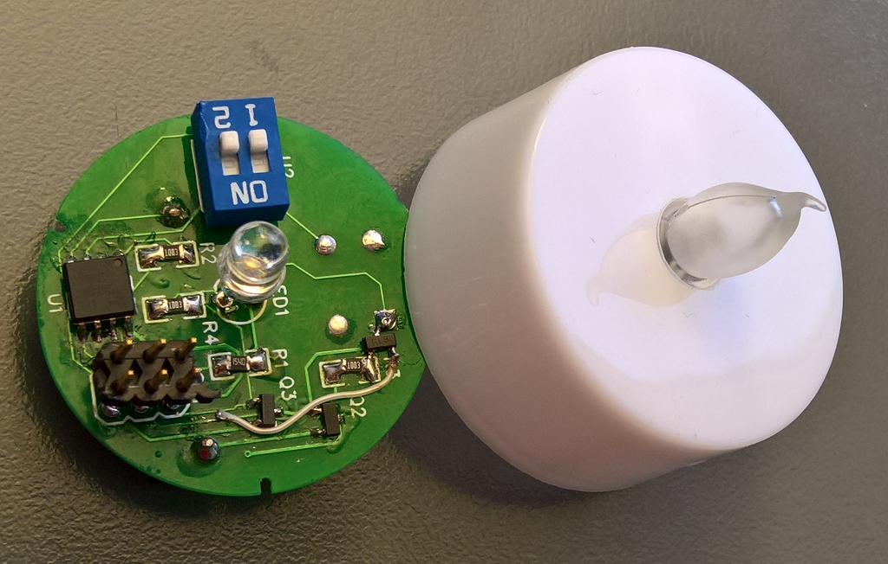

# ledcandle
Led candle with push button and timer for auto power off

A project for my [childs room-sky](https://www.youtube.com/watch?v=BvMHdN5_T0Q), it is a candle:
- with auto power off after 10 minutes
- nice and harmonic flicker effects (not aggressive)
- durable, will not be empty after 1 night. Should works for 1 year.
- small, so you can place it in a standard tea-light candle.

It works with an ATTiny45V (Arduino project)

Design and PCB are open source and hosted on Easy Eda:
https://easyeda.com/tiger54/led_candle-13fe66ec4c4447c1abb9b866b1f16509

Copy of the schematics and the Arduino code is hosted on GitHub.
